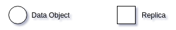
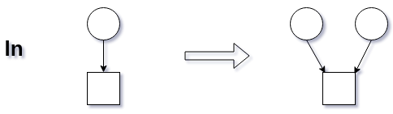
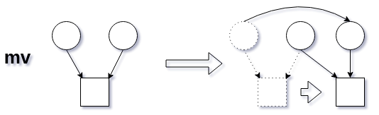
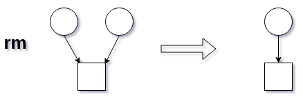
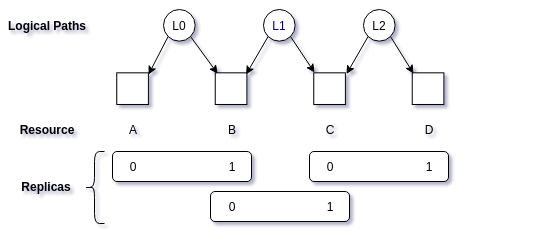

- Feature Name: iRODS Hard-Links
- Status: draft
- Start Date: 2019-11-04
- Authors: Kory Draughn
- RFC PR: N/A
- iRODS Issue: https://github.com/irods/irods_client_nfsrods/issues/57

# Summary
The goal of this RFC is to present the groundwork for how hard-links **could** be supported in iRODS as well as see if the community is interested in
such a feature.

# Motivation
NFSRODS needs to provide support for hard-links. Instead of implementing a solution specific to NFSRODS, it would be best if a generic solution
(most likely in the form of a Rule Engine Plugin) could be produced so that the community can leverage hard-links as well. Having a generic solution also means
that future projects (e.g. SMBRODS) will not have to reinvent the wheel.

## Hard-Link Representation in iRODS
A hard-link has the following characteristics:
- All affiliated data objects have different logical paths.
- All affiliated data objects point to the same replica.
- All affiliated data objects have the following AVU:
  + name: `irods::hard_link`
  + value: `<UUID>`
  + unit: `<undefined>`

The `UUID` defines the link between all data objects associated with a particular replica.

## Operations that affect Hard-Links
The following sections describe, on a high-level, the operations that affect hard-links. Each section contains a diagram that
presents the result of each operation.

The diagrams use the following legend:
<p align="center">
    
</p>

### Create (e.g. ln)
The creation of a hard-link can be simulated using existing icommands. For example, let:
- `<data_object>` be a data object in the catalog.
- `<replica>` be the file on disk `<data_object>` is pointing to.
- `<new_logical_path>` be a new logical path that also points to `<replica>`.
- `<UUID>` be a new unique ID.
```bash
$ ireg <replica> <new_logical_path>
$ imeta add -d <new_logical_path> irods::hard_link <UUID>
$ imeta add -d <data_object> irods::hard_link <UUID>
```
<p align="center">
    
</p>

### Move/Rename (e.g. mv)
Moving a hard-link requires updating the hard-link and system AVUs on all affiliated data objects. It also means potentially
updating other user-defined metadata for each data object, which could be expensive. 

The following pseudo code demonstrates the steps needed to maintain hard-links following a move operation:
```python
move(src_data_object, dst_data_object)
{
    data_objects = catalog.get_data_objects_by_uuid(src_data_object.uuid);

    for (dobj in data_objects)
    {
        dobj.set_replica_path(dst_data_object.physical_path);
        dobj.set_hard_link_metadata(dst_data_object.hard_link_metadata);
        dobj.set_expensive_user_defined_metadata(dst_data_object.user_defined_metadata); # Maybe?
    }
}
```
<p align="center">
    
</p>

See the section below on [User-Defined Metadata](#user-defined-metadata).

### Remove (e.g. rm)
Removing a hard-link is accomplished by unregistering the logical path. For example:
```bash
$ irm -U -n <replica_number> <logical_path/of/hard_linked/data_object>
```
<p align="center">
    
</p>

## Rule Engine Plugin Skeleton
```python
# Verifies permissions on the target data object. This is necessary for situations
# where the permissions on the target data object have changed.
def pep_api_data_obj_open_pre(rule_args, callback, rei):
    pass

# See "pep_api_data_obj_open_pre".
def pep_api_data_obj_open_and_stat_pre(rule_args, callback, rei):
    pass

# See "pep_api_data_obj_open_pre".
def pep_api_data_obj_create_pre(rule_args, callback, rei):
    pass

# Verifies that the relationship between the source and destination data objects and
# decides whether to allow the operation to continue or not.
def pep_api_data_obj_rename_pre(rule_args, callback, rei):
    pass

# Adjusts the hard-links and if necessary, other system metadata.
def pep_api_data_obj_rename_post(rule_args, callback, rei):
    pass

# Capture the hard-link state for processing in the corresponding post PEP.
def pep_api_data_obj_unlink_pre(rule_args, callback, rei):
    pass

# If the number of hard-links is greater than 1, then unregister the data object.
# If the number of hard-links is equal to 1, then delete the data object entirely.
def pep_api_data_obj_unlink_post(rule_args, callback, rei):
    pass

# If system metadata changes on any hard-link, apply those same metadata operations to
# all other data objects with a matching UUID.
#
# Should this operation be atomic?
def pep_api_mod_data_obj_meta_post(rule_args, callback, rei):
    pass
```

## User-Defined Metadata
Should all hard-linked logical paths in iRODS get identical user-defined AVUs?

The case against this is that some iRODS clients do not have any concept of iRODS AVUs.

The case for this is that extended attributes in Linux do appear on hard-linked files.
```bash
$ touch a.file
$ getfattr -d a.file
$ setfattr -n user.apples -v bananas a.file 
$ getfattr -d a.file
# file: a.file
user.apples="bananas"

$ stat a.file 
  File: 'a.file'
  Size: 0               Blocks: 0          IO Block: 4096   regular empty file
Device: 802h/2050d      Inode: 12582947    Links: 1
Access: (0664/-rw-rw-r--)  Uid: ( 1000/    rods)   Gid: ( 1000/    rods)
Access: 2019-11-05 12:46:45.611229425 -0500
Modify: 2019-11-05 12:46:45.611229425 -0500
Change: 2019-11-05 12:47:42.579989192 -0500
 Birth: -
$ ln a.file b.file
$ getfattr -d b.file
# file: b.file
user.apples="bananas"

$ stat b.file 
  File: 'b.file'
  Size: 0               Blocks: 0          IO Block: 4096   regular empty file
Device: 802h/2050d      Inode: 12582947    Links: 2
Access: (0664/-rw-rw-r--)  Uid: ( 1000/    rods)   Gid: ( 1000/    rods)
Access: 2019-11-05 12:46:45.611229425 -0500
Modify: 2019-11-05 12:46:45.611229425 -0500
Change: 2019-11-05 12:48:10.116356454 -0500
 Birth: - 
```

## Things to Consider
- Hard-links are not valid/allowed for collections. Data objects only.
- Hard-links that are one of many replicas of a data object.
- How should permissions interact with hard-links?
- Symlinks/soft-links are out of scope for this RFC. Those are logical path to logical path.

## Complex Scenarios
Supporting hard-links in iRODS presents new scenarios. The diagram below presents one such scenario where there are multiple
hard-link created data objects (i.e. logical paths) which point to the same replica. Supporting relationships like the one below
may require more than the introduction of a new Rule Engine Plugin.
<p align="center">
    
</p>

